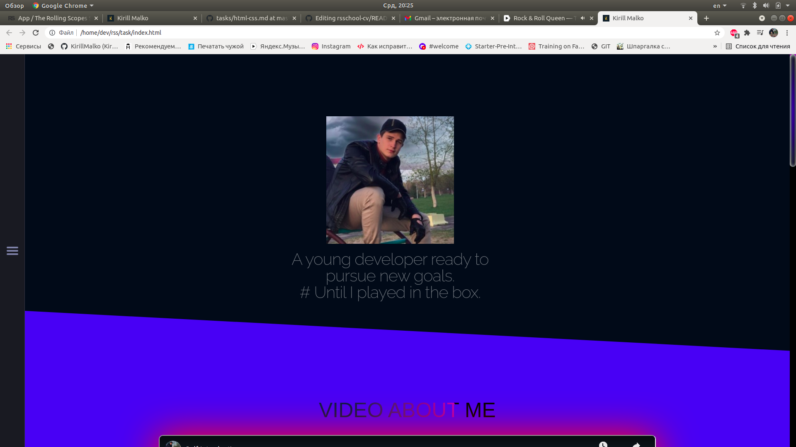
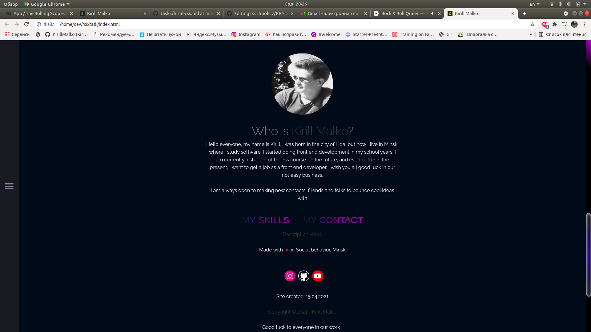

# rsschool-cv 
* https://kirillmalko.github.io/rsschool-cv/index.html
* вёрстка валидная +10
* Надпись "Document checking completed. No errors or warnings to show."
* вёрстка семантическая +10
* 2 балла за каждый уникальный семантический тег HTML5, но не больше 10 баллов
* используются заголовки h1-h6 +10
* 5 баллов за каждый уникальный заголовок, но не больше 10 баллов
* для оформления СV используются css-стили +10
* контент размещается в блоке, который горизонтально центрируется на странице +10
* на странице СV присутствует изображение, пропорции изображения не искажены, у изображения есть атрибут alt +10
* контакты для связи и перечень навыков оформлены в виде списка ul > li +10
* CV содержит контакты для связи, краткую информацию о себе, перечень навыков, примеры кода или выполненных проектов, информацию об образовании и уровне английского +10
* CV выполнено на английском языке +10
* выполнены требования к репозиторию: есть ссылка на задание, скриншот страницы СV, ссылка на деплой страницы CV на GitHub Pages, выполнена самооценка +10
* screen: 
* 
* 
# Итого: 100 баллов

